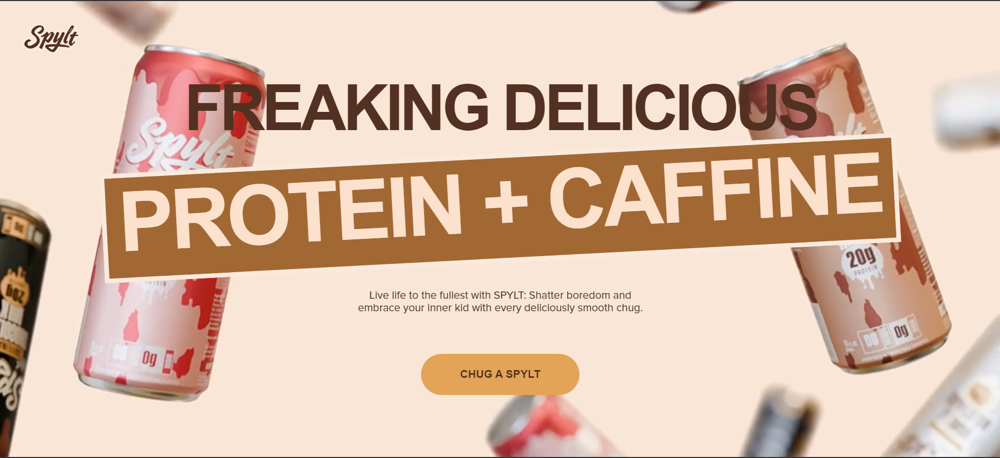

# GSAP Animation Practice Project - Spylt.com Clone

---

## Overview

This project is a clone of [Spylt.com](https://www.spylt.com/), created as a learning exercise to master advanced GSAP animations and smooth scrolling techniques. My primary focus was on implementing complex animations and understanding how to create engaging user experiences with GreenSock Animation Platform (GSAP).

**Live Demo:** [milky-motion.vercel.app](https://milky-motion.vercel.app)  
**GitHub Repo:** [GSAP_Project on GitHub](https://github.com/jimit8929/GSAP_Project)

> **Disclaimer:** This is an educational project created solely for practicing GSAP animations. All design and content credits belong to the original Spylt website and its creators.

---

## 🎯 Project Goals

- Master GSAP animation techniques  
- Implement complex scroll‑triggered animations  
- Create smooth, performant transitions  
- Practice responsive animation design  
- Explore GreenSock’s advanced plugins  

---

## 🛠️ Technologies Used

---

## ✨ Key Features

- Scroll‑triggered animations with direction awareness  
- Text splitting and character animations  
- Staggered element reveals with custom timing  
- Smooth scrolling with momentum effect  
- Scroll‑linked video playback with fade effects  
- Responsive animations for all devices  

---

## 🚀 Learning Highlights

- Mastered GSAP timelines and sequencing  
- Implemented complex scroll‑based animations  
- Created direction‑aware animations (scroll up/down)  
- Optimized animations for performance  
- Used GSAP plugins: ScrollTrigger, SplitText  
- Integrated Smoother Motion for enhanced scrolling  

---

## 🧩 Challenges Overcome

- Scroll‑triggered video playback control  
- Direction‑based animation reversal  
- Mobile‑responsive animations  
- Performance optimization  
- Complex text animations with SplitText  
- Smooth scroll implementation  

---

## 🎓 Educational Value

This project served as an intensive GSAP learning experience, helping me understand professional animation techniques, scroll‑linked animations, responsive animation design, and performance optimization.

---

## 🔮 Future Improvements

- 3D product viewer  
- Physics‑based animations  
- Interactive product customization  
- Enhanced mobile touch interactions  
- Accessibility features for animations  

---

## 📜 License

This project is licensed under the MIT License - see the [LICENSE](LICENSE) file for details.

---

*Crafted with ❤️ by jimit8929.*  
Feel free to fork, experiment, and learn!
